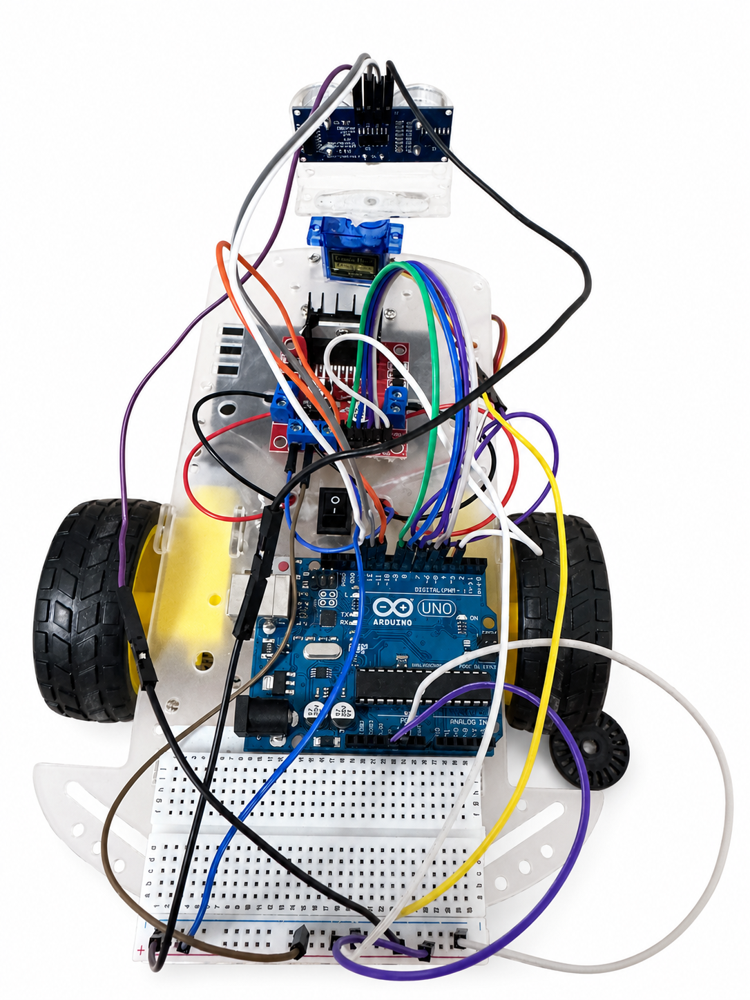

# Autonomous Wall & Line Following Robot

An Arduino-based autonomous mobile robot designed for wall following, path-boundary tracking, and obstacle avoidance using ultrasonic sensing and motor control.



## Overview

The robot is designed to move inside an approximately 50 cm path while maintaining a safe distance from the wall and remaining inside the defined boundary.

Its navigation logic combines three behaviors:

1. **Path-boundary protection** — detects the boundary and steers the robot back inside the allowed path.
2. **Obstacle avoidance** — detects obstacles in front, scans both sides, and turns toward the side with more free space.
3. **Wall following** — maintains a target distance from the wall while continuing forward.

## Main Features

- Autonomous forward navigation
- Wall-distance correction
- Path / line boundary detection
- Front obstacle detection
- Servo-based ultrasonic scanning
- Automatic left/right bypass decision
- Differential DC motor control through L298N
- Serial monitoring for navigation states and sensor readings
- Configurable speeds, distances, angles, and timing values

## Hardware

- Arduino Uno
- HC-SR04 ultrasonic distance sensor
- SG90 servo motor
- 2 digital IR line / boundary sensors
- L298N motor driver
- 2 DC motors
- Robot chassis and wheels
- Battery / power supply

## Control Architecture

```text
               +----------------------+
               | Boundary / IR Sensors|
               +----------+-----------+
                          |
                          v
+----------------+   +----+--------------------+
| HC-SR04 Sensor |-->| Arduino Navigation Logic|
+--------+-------+   +----+--------------------+
         |                |
         v                v
+----------------+   +-------------------+
| SG90 Servo Scan|   | L298N Motor Driver|
+----------------+   +---------+---------+
                               |
                               v
                         +-----------+
                         | DC Motors |
                         +-----------+
```

## Navigation Priority

The control loop gives priority to safety and path containment:

```text
1. Boundary detected?
      -> Reverse and steer back inside the path

2. Obstacle detected ahead?
      -> Stop
      -> Scan left and right
      -> Choose the clearer side
      -> Bypass the obstacle

3. Otherwise
      -> Measure wall distance
      -> Correct steering
      -> Continue forward
```

## Wall Following

The control code follows the wall on the left side.

A target wall distance is defined in the configuration section:

```cpp
const float TARGET_WALL_DISTANCE_CM = 15.0;
const float WALL_TOLERANCE_CM = 3.0;
```

The robot:

- Steers toward the wall if it is too far away
- Steers away from the wall if it is too close
- Continues straight when the distance is within tolerance

## Obstacle Avoidance

When an object is detected within the configured obstacle threshold:

```cpp
const float OBSTACLE_DISTANCE_CM = 20.0;
```

the robot:

1. Stops
2. Scans the left side
3. Scans the right side
4. Compares the available distances
5. Turns toward the side with more clearance
6. Moves around the obstacle
7. Re-centers and continues navigation

## Boundary Tracking

Two digital IR sensors are used to detect the path boundary.

The control logic reacts as follows:

| Detection | Robot Action |
|---|---|
| Left boundary only | Reverse and steer right |
| Right boundary only | Reverse and steer left |
| Both boundaries | Reverse and perform a U-turn |

## Arduino Code

Main file:

`autonomous_robot_control.ino`

The code is organized into separate sections for:

- User configuration
- Main navigation loop
- Boundary handling
- Obstacle avoidance
- Wall following
- Ultrasonic distance measurement
- Motor control
- Serial debugging

## Configuration

The main hardware pins and navigation parameters are grouped at the beginning of the Arduino file so they can be adjusted easily.

Examples include:

```cpp
const int BASE_SPEED = 150;
const int TURN_SPEED = 165;

const uint8_t FRONT_ANGLE = 90;
const uint8_t LEFT_ANGLE  = 150;
const uint8_t RIGHT_ANGLE = 30;
```

If the physical wiring differs, update the pin assignments before uploading the program.

## Uploading to Arduino

1. Open `autonomous_robot_control.ino` in the Arduino IDE.
2. Select the correct Arduino board and COM port.
3. Verify the motor-driver, ultrasonic-sensor, servo, and line-sensor pin assignments.
4. Compile the sketch.
5. Upload it to the Arduino.
6. Open the Serial Monitor at `9600` baud to observe sensor readings and navigation states.

## Repository Files

- `autonomous_robot_control.ino` — Arduino navigation and motor-control code
- `autonomous-robot-hardware.png` — project hardware photo
- `README.md` — project documentation

## Technologies

- Arduino
- C/C++
- Embedded Systems
- Robotics
- Ultrasonic Sensing
- IR Boundary Detection
- PWM Motor Control
- L298N Motor Driver
- Servo Scanning
- Autonomous Navigation
- Obstacle Avoidance

## Author

**Mohammad Ahmad Elayyan**

- Email: [mohamadelayyan84@gmail.com](mailto:mohamadelayyan84@gmail.com)
- LinkedIn: https://www.linkedin.com/in/mohammadelayyan1
- GitHub: [MohammadElayyan117](https://github.com/MohammadElayyan117)
